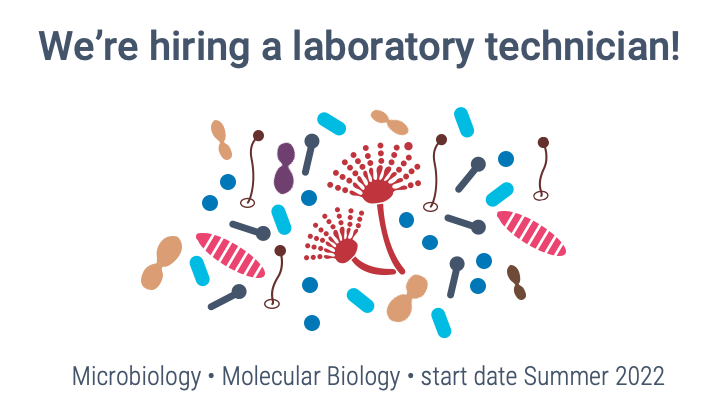

**The group is hiring a research technician with a start date of Summer 2022.** Position is a great fit for someone interested in microbiology and/or molecular biology. 

What they will do:
- Contribute to the research activities of the lab through maintenance of bacterial and fungal stocks, cultivation of microorganisms, and molecular biology analyses
- Evaluate research data in consultation with scientific staff and document all laboratory activities electronically
- Assist with laboratory organization and training other researchers, including Masters' and Bachelors' students, where required.
- Contribute to maintaining the friendly, welcoming, and collaborative environment within the group.

Desired profile:
- Completed training as a biological laboratory technician, biological technical assistant, or a BS in the life sciences with additional laboratory experience outside of your studies. Candidates in the final stages of obtaining their degree are also eligible to apply.
- A good understanding of biology and the ability quickly familiarize yourself with new content and skills
- Able to work in a S2 laboratory. Previous experience working with level 2 organisms and aseptic technique are a plus.
- Desirable methodological skills: microbial culture techniques and molecular biology techniques such as extraction of nucleic acids, PCR, and DNA sequence analysis.
- An integrative and cooperative personality with enthusiasm for supporting group research activities
- English communication skills, both written and spoken

More details and applications at **https://jobs.uni-jena.de/jobposting/19685d4f73b2956bb7a2b414d225e2d772c5ee530**